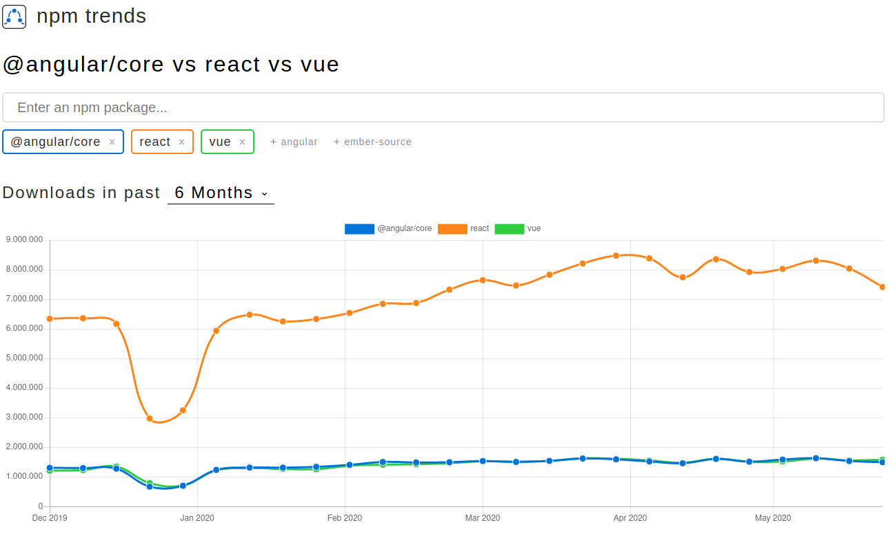
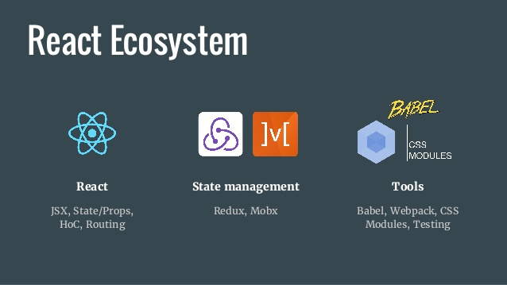
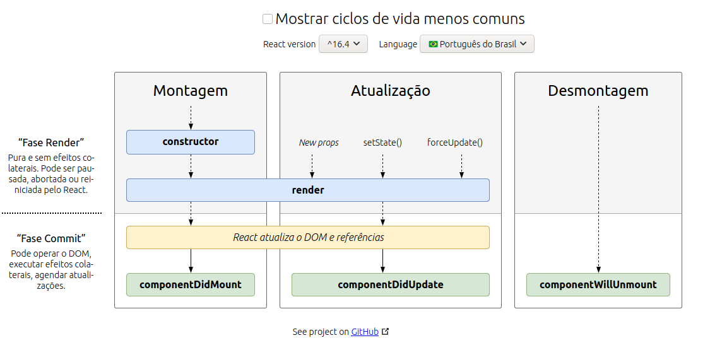

# React


* Uma biblioteca JavaScript para criar interfaces de usuário

Como definido por seus criadores, React é “uma biblioteca JavaScript declarativa, eficiente e flexível para a criação de interfaces de usuário (UI)”.

Essa biblioteca surgiu em 2011, no Facebook, e passou a ser utilizada na interface do mural de notícias da rede social.

No ano seguinte, passou a integrar também a área de tecnologia do Instagram e de várias outras ferramentas da empresa. Em 2013, o código foi aberto para a comunidade, o que colaborou para sua grande popularização.

## Comparação de Tecnologias



Podemos ver que está bem estável hoje em dia a quantidade de Downloads na npm.

### Ecosistema React



Algum exemplo de ecossistema React separando as bibliotecas com suas devidas responsabilidades.

Os gerenciadores de estados mais comuns são Redux e MobX.

## Hello World

O menor exemplo de React é algo assim:

```jsx
ReactDOM.render(
  <h1>Hello, world!</h1>,
  document.getElementById('root')
);
```

Isso mostra um header dizendo “Hello, world!” na página.

---

## Introduzindo JSX

Considere esta declaração de variável:

```jsx
const element = <h1>Hello, world!</h1>;
```

Esta sintaxe estranha de tags não é uma string, nem HTML.

É chamada JSX e é uma extensão de sintaxe para JavaScript. Recomendamos usar JSX com o React para descrever como a UI deveria parecer. JSX pode lembrar uma linguagem de template, mas que vem com todo o poder do JavaScript.

JSX produz “elementos” do React. Nós iremos explorar a renderização para o DOM na próxima seção. Abaixo você descobrirá o básico de JSX necessário para começar.
Por que JSX?

O React adota o fato de que a lógica de renderização é inerentemente acoplada com outras lógicas de UI: como eventos são manipulados, como o state muda com o tempo e como os dados são preparados para exibição.

Ao invés de separar tecnologias artificialmente colocando markup e lógica em arquivos separados, o React separa conceitos com unidades pouco acopladas chamadas “componentes” que contém ambos. Voltaremos aos componentes em outra seção. Mas, se você ainda não está confortável em usar markup em JS, esta palestra pode convencer você do contrário.

No exemplo abaixo, declaramos uma variável chamada name e então a usamos dentro do JSX ao envolvê-la com chaves:

```jsx
const name = 'Josh Perez';const element = <h1>Hello, {name}</h1>;
ReactDOM.render(
  element,
  document.getElementById('root')
);
```

Você pode inserir qualquer expressão JavaScript válida dentro das chaves em JSX. Por exemplo, 2 + 2, user.firstName, ou formatName(user) são todas expressões JavaScript válidas.

No exemplo abaixo, incorporamos o resultado da chamada de uma função JavaScript, formatName(user), dentro de um elemento.

```html
<h1>Hello</h1>
```

Criamos uma função

```jsx
function formatName(user) {
  return user.firstName + ' ' + user.lastName;
}
```

```jsx
const user = {
  firstName: 'Harper',
  lastName: 'Perez'
};
```

```jsx
const element = (
  <h1>
    Hello, {formatName(user)}!  
  </h1>
);
```

```jsx
ReactDOM.render(
  element,
  document.getElementById('root')
);
```

Separamos o JSX em múltiplas linhas para melhorar a legibilidade. Mesmo que não seja obrigatório, quando fizer isso, também recomendamos colocar dentro de parênteses para evitar as armadilhas da inserção automática de ponto-e-vírgula.
JSX Também é uma Expressão

Depois da compilação, as expressões em JSX se transformam em chamadas normais de funções que retornam objetos JavaScript.

Isto significa que você pode usar JSX dentro de condições if e laços for, atribuí-lo a variáveis, aceitá-lo como argumentos e retorná-los de funções:

```jsx
function getGreeting(user) {
  if (user) {
    return <h1>Hello, {formatName(user)}!</h1>;  }
  return <h1>Hello, Stranger.</h1>;}
```

Especificando Atributos com JSX

Você pode usar aspas para especificar strings literais como atributos:

```jsx
const element = <div tabIndex="0"></div>;
```

Você também pode usar chaves para incorporar uma expressão JavaScript em um atributo:

```jsx
const element = </img>;
```

Especificando Elementos Filhos com JSX

Se uma tag está vazia, você pode fechá-la imediatamente com />, como XML:

```jsx
const element = ;
```

Tags JSX podem conter elementos filhos:

```jsx
const element = (
  <div>
    <h1>Hello!</h1>
    <h2>Good to see you here.</h2>
  </div>
);
```

JSX Previne Ataques de Injeção

É seguro incorporar entradas de usuário em JSX:

```jsx
const title = response.potentiallyMaliciousInput;
// This is safe:
const element = <h1>{title}</h1>;
```

Por padrão, o React DOM escapa quaisquer valores incorporados no JSX antes de renderizá-los.
Assim, assegura que você nunca injete algo que não esteja explicitamente escrito na sua aplicação.
Tudo é convertido para string antes de ser renderizado. Isso ajuda a prevenir ataques XSS (cross-site-scripting).
JSX Representa Objetos

O Babel compila JSX para chamadas React.createElement().

Estes dois exemplos são idênticos:

```jsx
const element = (
  <h1 className="greeting">
    Hello, world!
  </h1>
);
```

```jsx
const element = React.createElement(
  'h1',
  {className: 'greeting'},
  'Hello, world!'
);
```

```tsx
React.createElement()
```

Realiza algumas verificações para ajudar você a criar um código sem bugs, mas, essencialmente, cria um objeto como este:

```jsx
// Nota: esta estrutura está simplificada
const element = {
  type: 'h1',
  props: {
    className: 'greeting',
    children: 'Hello, world!'
  }
};
```

### Ciclo de vida

Todo componente no React possui um ciclo de vida, dizemos que os componentes são montados em tela, podem sofrer alterações e no fim são desmontados. Assim, a cada passo do ciclo de vida de um componente conseguimos chamar métodos interceptando sua renderização tradicional ou captando informações desse ciclo. Esses métodos são definidos junto à classe do componente, o render é um deles.

### constructor

Apenas de não estar diretamente atrelado ao ciclo de vida do componente, o método constructor é a primeira função executada no componente.

```jsx
class App extends Component {
  constructor(props) {
    super(props);
  }
}
```

### render

Logo após, o método render é chamado construindo a View do nosso componente, esse método é chamado toda vez que uma alteração nas propriedades ou estado do componente é realizada. Você não deve utilizar qualquer função nesse método, apenas retornar conteúdo JSX.
componentDidMount

Chamado após o render indica que a renderização inicial do nosso componente foi finalizada, é o local recomendado para fazer qualquer processo assíncrono ou de efeito colateral como chamadas à API, referenciar componentes criados no render ou inclusive alterar o estado, disparando uma nova atualização no fluxo do componente.

```tsx
class App extends Component {
  componentDidMount() {
    // O render já executou, o que faremos agora?
  }
}
```

Agora finalizamos os métodos responsáveis pela primeira renderização dos componentes e vamos partir para os métodos responsáveis pela atualização no ciclo de vida:
componentWillReceiveProps

Executado automaticamente toda vez que alguma propriedade do componente for atualizada, por exemplo, imagine estarmos passando a propriedade title ao componente da seguinte forma:

```tsx
<App title="Meu título" />
```

E em algum momento alterarmos essa propriedade Meu título para Outro título, o componentWillReceiveProps do App irá ser avisado e receberá como parâmetro as novas propriedades. Esse método é muito utilizado quando o estado do nosso componente é composto por propriedades, e dessa forma podemos alterar o estado por esse método:

```tsx
class App extends Component {
  componentWillReceiveProps(props) {
    this.setState({ title: `Aplicação ${props.title}` });
  }
}
```

### componentDidCatch

A partir do React 16 você já pode ouvir erros causados durante o ciclo de vida do componente utilizando o componentDidCatch, você inclusive pode passar esses erros para a View utilizando o setState:

```tsx
class App extends Component {
  componentDidCatch(error, info) {
    this.setState({ errorMessage: error.message });
  }
}
```



### Stateless Components

Em muitos casos temos componentes que não possuem nenhum ciclo de vida ou estado e retornam apenas JSX, nesse caso chamamos eles de Stateless Components e podem ser escritos utilizando uma sintaxe mais limpa:

Class Component

```tsx
class App extends Component {
  render() {
    return (
      <Text>{props.title}</Text>
    )
  }
}
```

Stateless Component

```tsx
const App = (props) => (
  <Text>{props.title}</Text>
);
```

Componente em função

```tsx
function Clock(props) {
  return (
    <div>
      <h1>Hello, world!</h1>
      <h2>It is {props.date.toLocaleTimeString()}.</h2>
    </div>  
  );
}
```

Componente em classe

```tsx
class Clock extends React.Component {
  render() {
    return (
      <div>
        <h1>Hello, world!</h1>
        <h2>It is {this.props.date.toLocaleTimeString()}.</h2>
      </div>
    );
  }
}
```