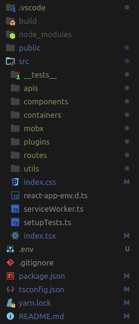

# Aula 01

## Links úteis

* <https://github.com/kamranahmedse/developer-roadmap>
* <https://github.com/enaqx/awesome-react>
* <https://create-react-app.dev>
* <https://codepen.io/pen/>
* [Projeto Final](https://github.com/juninmd/unifacef-react-typescript)
* <https://projects.wojtekmaj.pl/react-lifecycle-methods-diagram/>
* <https://sentry.io/welcome/>
* <https://github.com/juninmd/star-wars-api>
* <https://github.com/juninmd/unifacef-react-typescript>
* <https://app.netlify.com/>

## Ementa

* Revisão dos Conceitos WEB
  * Exercícios HTML
  * Exercícios JavaScript + DOM
  * Exercícios CSS
  * Criando primeiro Projeto
  * Configurando o projeto com novas bibliotecas
    * Axios
    * React Router
    * MobX
    * Semantic UI React
    * Variáveis de Ambiente
    * Tratativas de Erro

## Ordem

  1. [Revisão](./revisao.md)
  2. [Tools](./tools.md)
  3. [React](./react.md)

## Criando o projeto

> Lembre-se que irémos usar como convenção sempre o padrão de nomeclatura de arquivos e pastas `kebab-case`

Projeto Final disponível em: <https://github.com/juninmd/unifacef-react-typescript>

Vamos iniciar utilizando o comando

```bash
npx create-react-app unifacef-react-typescript --template typescript
```

Abra a pasta

```bash
cd unifacef-react-typescript
```

Adcionar Título da página

No arquivo

> public/index.html

Vamos alterar o atributo do título para

```tsx
 <title>Unifacef React App</title>
```

Abra o arquivo

> src/app.tsx

E modifiquem o conteúdo em texto e deixem a página recarregar.


Vamos agora adicionar novas dependencias aos projeto

```bash
yarn add axios history jsonwebtoken semantic-ui-css semantic-ui-react sweetalert2 @sentry/browser lodash mobx mobx-react mobx-react-router react-router-dom sweetalert2 @types/react-router-dom @types/history @types/lodash @types/node
```

Ajustar dependencias no `package.json`, separar o que é dependência de desenvolvimento e de projeto.

Seu package.json deve ficar assim:

```json
{
  "name": "unifacef-react-typescript",
  "version": "1.0.0",
  "private": true,
  "dependencies": {
    "@sentry/browser": "^5.16.1",
    "axios": "^0.19.2",
    "history": "^4.10.1",
    "jsonwebtoken": "^8.5.1",
    "lodash": "^4.17.15",
    "mobx": "^5.15.4",
    "mobx-react": "^6.2.2",
    "mobx-react-router": "^4.1.0",
    "react": "^16.13.1",
    "react-dom": "^16.13.1",
    "react-router-dom": "^5.2.0",
    "semantic-ui-css": "^2.4.1",
    "semantic-ui-react": "^0.88.2",
    "sweetalert2": "^9.14.0"
  },
  "devDependencies": {
    "@types/react-router-dom": "^5.1.5",
    "@testing-library/jest-dom": "^4.2.4",
    "@testing-library/react": "^9.3.2",
    "@testing-library/user-event": "^7.1.2",
    "@types/history": "^4.7.6",
    "@types/jest": "^24.0.0",
    "@types/lodash": "^4.14.155",
    "@types/node": "^14.0.11",
    "@types/react": "^16.9.0",
    "@types/react-dom": "^16.9.0",
    "react-scripts": "3.4.1",
    "typescript": "~3.7.2"
  },
  "scripts": {
    "start": "react-scripts start",
    "build": "react-scripts build",
    "test": "react-scripts test",
    "eject": "react-scripts eject"
  },
  "eslintConfig": {
    "extends": "react-app"
  },
  "browserslist": {
    "production": [
      ">0.2%",
      "not dead",
      "not op_mini all"
    ],
    "development": [
      "last 1 chrome version",
      "last 1 firefox version",
      "last 1 safari version"
    ]
  }
}
```

Vamos utilizar nesse projeto como framework CSS o Semantic UI

<https://react.semantic-ui.com/>

Seus componentes são bem customizáveis

Após isso, crie uma conta na plataforma Sentry.

<https://sentry.io/welcome/>

Anote a variável dentro de um arquivo .env e cole como `REACT_APP_SENTRY_DSN`.

Vamos configurar o arquivo `tsconfig.json`

```json
{
  "compilerOptions": {
    "target": "es5",
    "moduleResolution": "node",
    "experimentalDecorators": true,
    "emitDecoratorMetadata": true,
    "preserveConstEnums": true,
    "pretty": true,
    "lib": [
      "dom",
      "dom.iterable",
      "esnext"
    ],
    "module": "esnext",
    "forceConsistentCasingInFileNames": true,
    "allowJs": true,
    "checkJs": true,
    "outDir": "./dist",
    "sourceMap": true,
    "strict": true,
    "typeRoots": [
      "./node_modules/@types"
    ],
    "skipLibCheck": true,
    "jsx": "react",
    "rootDir": "src",
    "noImplicitReturns": true,
    "noImplicitThis": true,
    "noImplicitAny": false,
    "strictNullChecks": true,
    "suppressImplicitAnyIndexErrors": true,
    "noUnusedLocals": true,
    "esModuleInterop": true,
    "allowSyntheticDefaultImports": true,
    "resolveJsonModule": true,
    "isolatedModules": true,
    "noEmit": true
  },
  "include": [
    "src"
  ]
}
```

Vamos criar a seguinte árvore de pastas no projeto:



Dentro de apis crie o arquivo `economy.api.ts`

```text
src/apis/economy.api.ts
```

Ficando assim:

```ts
import axios from 'axios';

export const getPrice = async () => {
  return axios.request({ url: 'https://economia.awesomeapi.com.br/json/all' })
}
```

Após isso, dentro de containers, crie a pasta home, e dentro dela crie dois arquivos ficando nos seguintes caminhos

```text
src/containers/home/store.ts
```

Dentro da store deixe assim:

```ts
import { getPrice } from './../../apis/economy.api';
import { action, observable } from 'mobx';

export default class HomeStore {
  @observable records: any[] = [];

  @action buildRecords = async () => {
    const { data } = await getPrice();
    this.records = Object.values(data);
  }

}
const home = new HomeStore();
export { home };

```

```text
src/containers/home/index.tsx
```

Dentro da index, deixe assim:

```tsx
import * as React from 'react';

import { Card, Container, Grid, Header, Icon } from 'semantic-ui-react';
import { inject, observer } from 'mobx-react';

import HomeStore from './store';
import NewRouterStore from '../../mobx/router.store';

interface Props {
  router: NewRouterStore;
  home: HomeStore;
}

@inject('router', 'home')
@observer
export default class Home extends React.Component<Props> {

  async componentDidMount() {
    const { buildRecords } = this.props.home;
    await buildRecords();
  }

  render() {

    const { records } = this.props.home;

    return (
      <Container>
        <Grid divided='vertically'>
          <Grid.Row columns={2}>
            <Grid.Column>
              <Header color='blue' as='h2'>
                <Header.Content>
                  Home
                 <Header.Subheader>Moedas agora</Header.Subheader>
                </Header.Content>
              </Header>
            </Grid.Column>
          </Grid.Row>
        </Grid>
        <Card.Group itemsPerRow={2}>
          {records.map((e) => {
            return (
              <Card>
                <Card.Content>
                  <Card.Meta><Icon name='dollar' />{e.name}</Card.Meta>
                  <Card.Description>R$ {e.ask}</Card.Description>
                </Card.Content>
              </Card>)
          })}
        </Card.Group>
      </Container>
    );
  }
}
```

Crie uma nova pasta dentro de containers chamada sobre

Adicione um arquivo index.tsx

```text
src/containers/sobre/index.tsx
```

```tsx
import * as React from 'react';
import { Container, Grid, Header } from 'semantic-ui-react';
import { inject, observer } from 'mobx-react';
import NewRouterStore from '../../mobx/router.store';

interface Props {
  router: NewRouterStore;
}

@inject('router')
@observer
export default class Sobre extends React.Component<Props> {
  render() {
    return (
      <Container>
        <Grid divided='vertically'>
          <Grid.Row columns={2}>
            <Grid.Column>
              <Header color='blue' as='h2'>
                <Header.Content>
                  Sobre
                 <Header.Subheader>Um pouco sobre mim</Header.Subheader>
                </Header.Content>
              </Header>
            </Grid.Column>
          </Grid.Row>
        </Grid>
      </Container>
    );
  }
}
```

Crie uma nova pasta chamada not-found

```text
src/containers/not-found/index.tsx
```

```tsx
import * as React from 'react';
import { Container } from 'semantic-ui-react';

export default class NotFound extends React.Component {

  render() {
    return (
      <Container><p>Página não encontrada!</p></Container>
    );
  }
}
```

Dentro de routes crie dois arquivos

```text
endpoints.ts
```

```ts
import { RouteProps } from 'react-router-dom';
import Sobre from '../containers/sobre';
import Home from '../containers/home';

const publicUrl = process.env.PUBLIC_URL;

interface EndPointsProps extends RouteProps {
  name?: string
}

export const endpoints: EndPointsProps[] = [
  { path: `${publicUrl}/`, component: Home, exact: true },
  { path: `${publicUrl}/home`, name: 'Home', component: Home, exact: true },
  { path: `${publicUrl}/sobre`, name: 'Sobre', component: Sobre, exact: true },
];
```

```text
index.tsx
```

```tsx
import * as React from 'react';
import { observer } from 'mobx-react';
import {
  Route,
  withRouter,
  Switch,
} from 'react-router-dom';
import { Divider } from 'semantic-ui-react';
import { endpoints } from './endpoints';

// @ts-ignore
@withRouter
@observer
export default class Routes extends React.Component {

  render() {
    return (
      <>
        <Divider hidden={true} />
        <Switch>
          {endpoints.map((route, i) => (
            <Route key={i} {...route} />)
          )}
          <Route path='*' exact={true} render={props => <NotFound {...props} />} />
        </Switch>
      </>
    );
  }
}
```