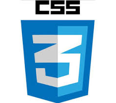

# Revisão

## HTML

É a sigla de HyperText Markup Language, expressão inglesa que significa "Linguagem de Marcação de Hipertexto". Consiste em uma linguagem de marcação utilizada para produção de páginas na web, que permite a criação de documentos que podem ser lidos em praticamente qualquer tipo de computador e transmitidos pela internet.

Para escrever documentos HTML não é necessário mais do que um editor de texto simples e conhecimento dos códigos que compõem a linguagem. Os códigos (conhecidos como tags) servem para indicar a função de cada elemento da página Web. Os tags funcionam como comandos de formatação de textos, formulários, links (ligações), imagens, tabelas, entre outros.

Os browsers (navegadores) identificam as tags e apresentam a página conforme está especificada. Um documento em HTML é um texto simples, que pode ser editado no Bloco de Notas (Windows) ou Editor de Texto (Mac) e transformado em hipertexto.

---

## JavaScript

É uma linguagem de programação criada em 1995 por Brendan Eich enquanto trabalhava na Netscape Communications Corporation. Originalmente projetada para rodar no Netscape Navigator, ela tinha o propósito de oferecer aos desenvolvedores formas de tornar determinados processos de páginas web mais dinâmicos, tornando seu uso mais agradável. Um ano depois de seu lançamento, a Microsoft portou a linguagem para seu navegador, o que ajudou a consolidar a linguagem e torná-la uma das tecnologias mais importantes e utilizadas na internet.

---

## CSS3

É a sigla para o termo em inglês Cascading Style Sheets que, traduzido para o português, significa Folha de Estilo em Cascatas. O CSS é fácil de aprender e entender e é facilmente utilizado com as linguagens de marcação HTML ou XHTML.

---

## Web Developer Roadmap

Podemos ver que hoje em dia Frontend pode ter muitas vertentes, totalmente diferente do que poderíamos ver alguns anos atrás.
