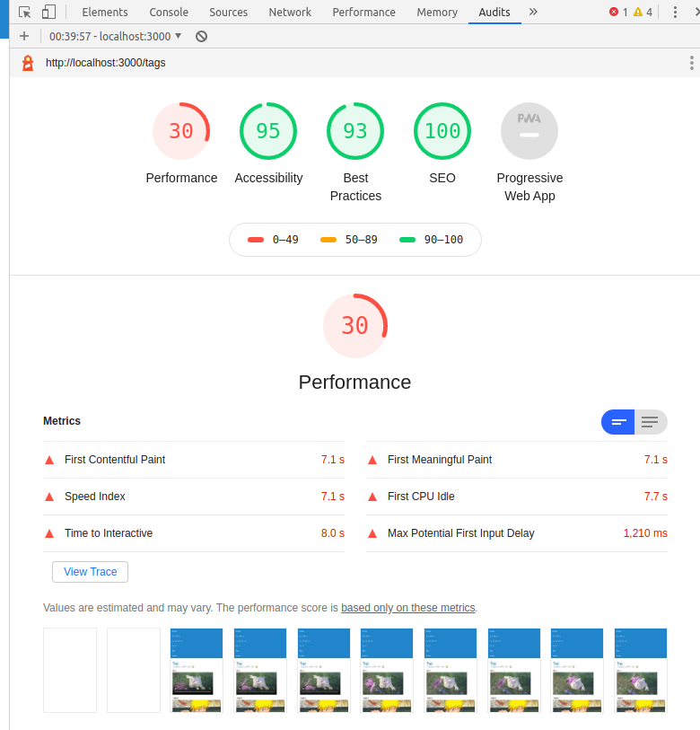

# Aula 02

## Links úteis

* [Projeto Final](https://github.com/juninmd/unifacef-react-typescript)
* [IndexDb](https://developer.mozilla.org/pt-BR/docs/Web/API/IndexedDB_API)
* [Cookie](https://developer.mozilla.org/pt-BR/docs/Web/HTTP/Headers/Cookie)
* [LocalStorage](https://developer.mozilla.org/pt-BR/docs/Web/API/Window/Window.localStorage)
* [SessionStorage](https://developer.mozilla.org/en-US/docs/Web/API/Window/sessionStorage)
* [PWA](https://medium.com/@victorsilvamatheus.i/como-transformar-sua-aplica%C3%A7%C3%A3o-reactjs-em-um-pwa-e-ser%C3%A1-que-voc%C3%AA-deve-fazer-isso-567a8552c96d)
* <https://whatwebcando.today/>
* <https://chrome.google.com/webstore/detail/lighthouse/blipmdconlkpinefehnmjammfjpmpbjk?hl=pt-BR>
* <https://developer.mozilla.org/pt-BR/docs/Web/API/IndexedDB_API/Usando_IndexedDB>
* <chrome://flags/#enable-desktop-pwas-without-extensions>
* <https://developer.mozilla.org/pt-BR/docs/Mozilla/Add-ons/WebExtensions/manifest.json>
* <https://www.google.com/chrome/>
* <https://youtu.be/8Vq993Td6ys>

## Ementa

* Star Wars
* Elementos Html5
* Storages
  * Cookies
  * LocalStorage
  * SessionStorage
  * Indexed DB
* PWA

## Star Wars

Crie uma nova pasta chamada star-wars dentro de apis

Crie um novo arquivo

```text
src/apis/star-wars.api.ts
```

```tsx
import axios from 'axios';

const baseURL = 'https://star-wars-api-unifacef.herokuapp.com'; // trocar por env de ambiente

export const getFilms = () => {
  return axios.request({ baseURL, url: 'films' })
}

export const getFilmById = (id: number) => {
  return axios.request({ baseURL, url: `films/${id}` })
}
```

Adicione as variáveis de ambiente nos seguintes arquivos

.env
.env.local

```env
REACT_APP_STAR_WARS_BASE_URL=https://star-wars-api-unifacef.herokuapp.com
```

Atualize a constante baseURL

```tsx
const baseURL = process.env.REACT_APP_STAR_WARS_BASE_URL;
```

Crie uma nova pasta chamada star-wars dentro de containers

Crie um novo arquivo

```text
src/containers/star-wars/store.ts
```

```tsx
import { action, observable } from 'mobx';
import { getFilms } from '../../apis/star-wars.api';

export default class StarWarsStore {
  @observable films: any[] = [];

  @action buildFilms = async () => {
    const { data } = await getFilms();
    this.films = data;
  }

}
const starWars = new StarWarsStore();
export { starWars };
```

Adicione a store na lista de stores

```text
src/mobx/index.ts
```

```tsx
import { router } from './router.store';
import { home } from '../containers/home/store';
import { combustivel } from '../containers/combustivel/store';
import { starWars } from '../containers/star-wars/store';

export {
  router,
  home,
  combustivel,
  starWars
};
```

Crie um novo arquivo

```text
src/containers/star-wars/index.tsx
```

```tsx
import * as React from 'react';
import { Container, Card, Grid, Header, Image } from 'semantic-ui-react';
import { inject, observer } from 'mobx-react';
import NewRouterStore from '../../mobx/router.store';
import StarWarsStore from './store';

interface Props {
  router: NewRouterStore;
  starWars: StarWarsStore;
}

@inject('router', 'starWars')
@observer
export default class StarWars extends React.Component<Props> {

  async componentDidMount() {
    const { buildFilms } = this.props.starWars;
    await buildFilms();
  }

  render() {

   const { films } = this.props.starWars;

    return (
      <Container>
        <Grid divided='vertically'>
          <Grid.Row columns={2}>
            <Grid.Column>
              <Header color='blue' as='h2'>
                <Header.Content>
                  Star Wars
                 <Header.Subheader>Lista de filmes</Header.Subheader>
                </Header.Content>
              </Header>
            </Grid.Column>
          </Grid.Row>
        </Grid>
        <Card.Group itemsPerRow={2}>
          {films.map((film, index) => {
            return (
              <Card key={index}>
                <Image src={film.photo} wrapped ui={false} size='small' />
                <Card.Content>
                  <Card.Meta>{film.title}</Card.Meta>
                  <Card.Description>Episode {film.episode_id.toString()}</Card.Description>
                </Card.Content>
              </Card>)
          })}
        </Card.Group>
      </Container>
    );
  }
}

```

Crie uma nova pasta chamada
`star-wars-details`
dentro de containers

Crie um novo arquivo

```text
src/containers/star-wars-details/store.ts
```

```ts
import { action, observable } from 'mobx';
import { getFilmById } from '../../apis/star-wars.api';

export default class StarWarsDetailsStore {
  @observable film: any = {};

  @action buildFilmById = async (id: number) => {
    const { data } = await getFilmById(id);
    this.film = data;
  }

}
const starWarsDetails = new StarWarsDetailsStore();
export { starWarsDetails };

```

Crie um novo arquivo

```text
src/containers/star-wars-details/index.tsx
```

```tsx
import * as React from 'react';
import { Container, Card, Grid, Header, Image, List } from 'semantic-ui-react';
import { inject, observer } from 'mobx-react';
import NewRouterStore from '../../mobx/router.store';
import StarWarsDetailsStore from './store';
import { RouteComponentProps } from 'react-router-dom';

interface Props {
  router: NewRouterStore;
  starWarsDetails: StarWarsDetailsStore;
}

@inject('router', 'starWarsDetails')
@observer
export default class StarWarsDetails extends React.Component<RouteComponentProps<{ id: string }> & Props>{

  async componentDidMount() {
    const { buildFilmById } = this.props.starWarsDetails;
    const id = Number(this.props.match.params.id);
    await buildFilmById(id);
  }

  render() {

    const { film } = this.props.starWarsDetails;

    return (
      <Container>
        <Grid divided='vertically'>
          <Grid.Row columns={2}>
            <Header color='blue' as='h2'>
              <Header.Content>
                Star Wars
                <Header.Subheader>
                  Detalhe do filme
                </Header.Subheader>
              </Header.Content>
            </Header>
          </Grid.Row>
        </Grid>
        <Card.Group>
          <Card>
            <Image src={film.photo} wrapped ui={false} size='small' />
            <Card.Content>
              <Card.Meta>{film.title} - Episode {film.episode_id}</Card.Meta>
            </Card.Content>
            <Card.Content extra>
              <p>Director: {film.director}</p>
              <p>Release Date: {film.release_date}</p>
            </Card.Content>
            <Card.Content>
              <p>Personagens:</p>
              <List divided={true} relaxed={true}>
                {film.characters?.map((character, indexChar) => {
                  return (
                    <List.Item key={indexChar}>
                      {character.name}
                    </List.Item>
                  )
                })}
              </List>
            </Card.Content>
          </Card>
        </Card.Group>
      </Container>
    )
  }
}
```

Adicionar novo endpoint em

```text
src/routes/endpoints.ts
```

```ts
import StarWarsDetails from "../containers/star-wars-details";
```

```ts
  { path: `${publicUrl}/star-wars/:id`, component: StarWarsDetails, exact: true },
```

Atualize a store

```text
src/mobx/index.ts
```

```ts
import { home } from '../containers/home/store';
import { combustivel } from '../containers/combustivel/store';
import { router } from './router.store';
import { starWars } from '../containers/star-wars/store';
import { starWarsDetails } from '../containers/star-wars-details/store';

export {
  router,
  combustivel,
  home,
  starWars,
  starWarsDetails,
}
```

---

Corrigir componente de Loading

```text
src/apis/axios.ts
```

```ts
import { loadingOn, loadingOff } from '../components/loading';
import axios from 'axios';

axios.interceptors.request.use((config) => {
  loadingOn();
  return config;
}, (error) => {
  return Promise.reject(error);
});

axios.interceptors.response.use((config) => {
  loadingOff();
  return config;
}, (error) => {
  loadingOff();
  return Promise.reject(error);
});
```

---

## PWA

Vamos conhecer um pouco dos recursos de PWA

Instale a extensão LightHouse
<https://chrome.google.com/webstore/detail/lighthouse/blipmdconlkpinefehnmjammfjpmpbjk?hl=pt-BR>

  
Habilitem as opções no chrome

```text
chrome://flags/#enable-desktop-pwas-local-updating
chrome://flags/#enable-desktop-pwas-local-updating-throttle-persistence
chrome://flags/#enable-desktop-pwas-tab-strip
chrome://flags/#enable-desktop-pwas-without-extensions
chrome://flags/#enable-desktop-minimal-ui
```

O Que podemos fazer hoje?

<https://whatwebcando.today/>

## MobX

<https://chrome.google.com/webstore/detail/mobx-developer-tools/pfgnfdagidkfgccljigdamigbcnndkod>

## Import Cost

Extensão VsCode `wix.vscode-import-cost`

## Forks

Caso queira copiar o projeto final e sincronizar com seu fork

```bash
git remote add upstream https://github.com/juninmd/unifacef-react-typescript.git
git pull upstream
```

Criar arquivo em:

```text
src/utils/object.util.ts
```

```ts
export function assign(obj: any, prop: string | string[], value: any) {

  if (prop === null || prop === undefined) {
    throw new Error('Propertie name undefined');
  }

  if (typeof prop === 'string') {
    prop = prop.split('.');
  }

  if (prop.length > 1) {
    const e = prop.shift();
    assign(obj[e!] =
      Object.prototype.toString.call(obj[e!]) === '[object Object]'
        ? obj[e!]
        : {},
      prop,
      value);
  } else {
    obj[prop[0]] = value;
  }
}
```

Crie uma pasta chamada cache dentro de containers

Adicione o seguinte conteúdo criando o arquivo store.ts dentro

```text
src/containers/cache/store.ts
```

```ts
import { observable, action } from 'mobx';
import { assign } from '../../utils/object.util';

export default class CacheStore {

  @observable session: string | null = '';

  @observable local: string | null = '';

  @observable cookie: string | null = '';

  @observable indexed: string | null = '';

  @action handleForm = (event: any, select?: any) => {
    const { name, value } = select || event.target;
    assign(this, name, value);
  }

  @action saveCookie = () => {
    document.cookie = `unifacef=${this.cookie}`
  }

  @action saveLocalStorage = () => {
    localStorage.setItem('unifacef-local', this.local || '');
  }

  @action saveSessionStorage = () => {
    sessionStorage.setItem('unifacef-session', this.session || '');
  }

  @action loadForm = () => {
    this.cookie = this.getCookie('unifacef')
  }

  @action submit = () => {
    this.saveCookie();
    this.saveSessionStorage();
    this.saveLocalStorage();
  }

  getCookie(cname) {
    const name = `${cname}=`
    const decodedCookie = decodeURIComponent(document.cookie);
    const ca = decodedCookie.split(';');
    for (let i = 0; i < ca.length; i++) {
      const c = ca[i];
      while (c.charAt(0) === ' ') {
        c.substring(1);
      }
      if (c.indexOf(name) === 0) {
        return c.substring(name.length, c.length);
      }
    }
    return "";
  }
}
const cache = new CacheStore();
export { cache };

```

## One Signal

<https://app.onesignal.com/apps/new>